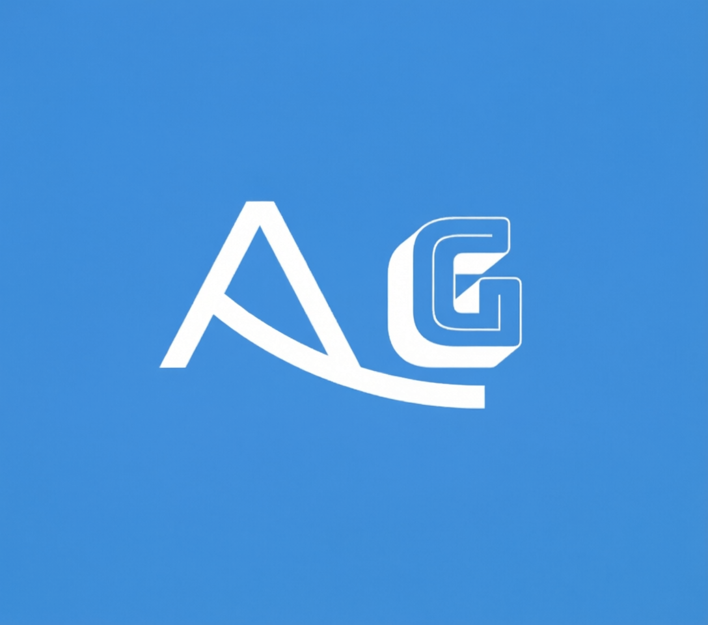

<div align="center">
  
</div>

# Halyay

**Thinker, Builder, and Observer.** | **Fakare, Abuure, iyo Daawade.**

Halyay is a bilingual (English & Somali) personal portfolio and blog. It is built with plain HTML, CSS and JavaScript, with no frameworks and no dependencies, and it is published for free with GitHub Pages. The published link is shown in the About section of this repository.

## Features

- 🌐 **Bilingual interface** — one click switches the whole site between English and Soomaali
- 🌙 **Dark mode with memory** — the site remembers your theme choice between visits
- 📝 **Blog cards** — each post carries a language tag (English / Soomaali / Mixed) and a "Read More" expander
- 📬 **Contact card** — one button opens the author's X profile
- 📱 **Fully responsive** — clean reading on phones, tablets and desktops
- ⚡ **Zero dependencies** — a single HTML file plus one logo image

## Project Structure

```text
halyay-portfolio/
├── index.html   # The entire website: layout, styles, translations and blog posts
├── logo.png     # The Halyay brand logo
└── README.md    # This file
```

## Run It Locally

1. Download or clone this repository.
2. Double-click `index.html`.
3. The site opens in your browser. No server, no installation, no build step.

## How Blog Posts Work

Blog posts currently live inside the `posts` list near the bottom of `index.html`. Each post has a title, a date, a language tag, a short summary and the full text. A future update will move publishing to a private Google Sheet so new posts can be written from a phone without touching any code.

## Roadmap

- Publish on the permanent domain `halyay.com`
- Sheet-based publishing (write a row, post goes live)
- Professional email on the Halyay domain

## Contact

- X: [@halyay](https://x.com/halyay)

## Soomaali

Halyay waa bog shakhsi ah oo labo luqood ku shaqeeya (Ingiriisi iyo Soomaali). Waxaa lagu dhisay HTML, CSS iyo JavaScript oo keliya, oo waxaa lagu daabacay GitHub Pages bilaash. Boggu wuxuu leeyahay hab madow, maqaallo labo luqood ah, iyo badhan xiriir oo toos ah.

---

© 2026 Halyay. All rights reserved.
